# Name the Cow

## TLDR
1. Download the APK.
2. Give your browser the permission to download it.
3. Allow the browser to make APK installations.
4. Actually install the app.
5. Take away the browser permissions for downloading executables (apps).

## Details
Installation instructions are broken up into the actual installation, and re-securing your phone afterwards. Please do **both** steps.

### Installation
1. Open up the [APK](https://github.com/daytrick/Cow_Flashcards/blob/master/app/release/name%20the%20cow.apk) on your phone's browser.
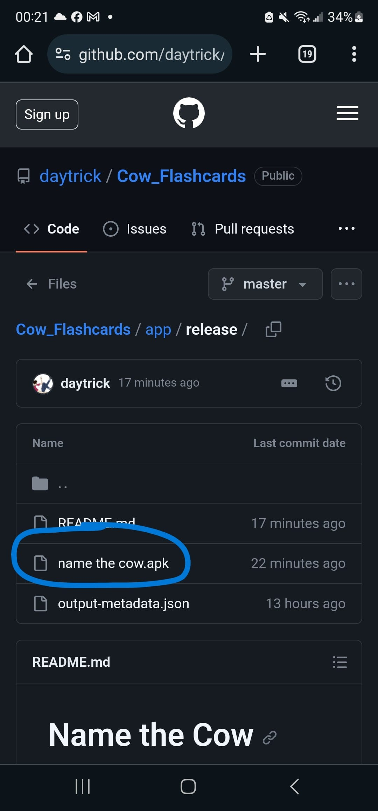
2. Click on the hamburger menu.
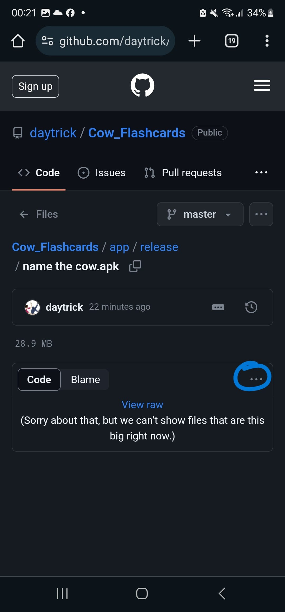
3. Download the file.
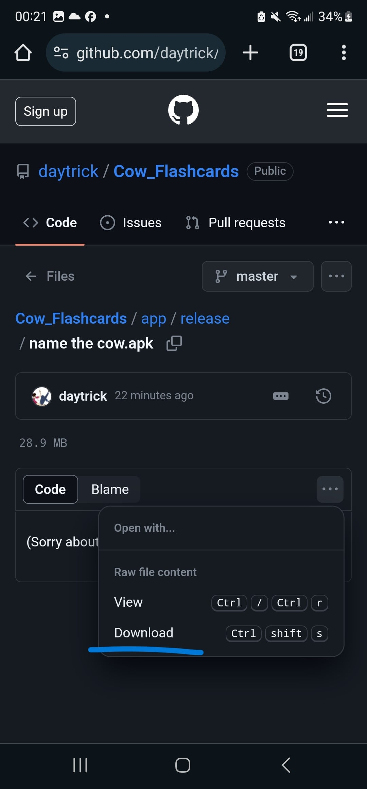
4. If your browser tells you the APK might be harmful, download it anyway.
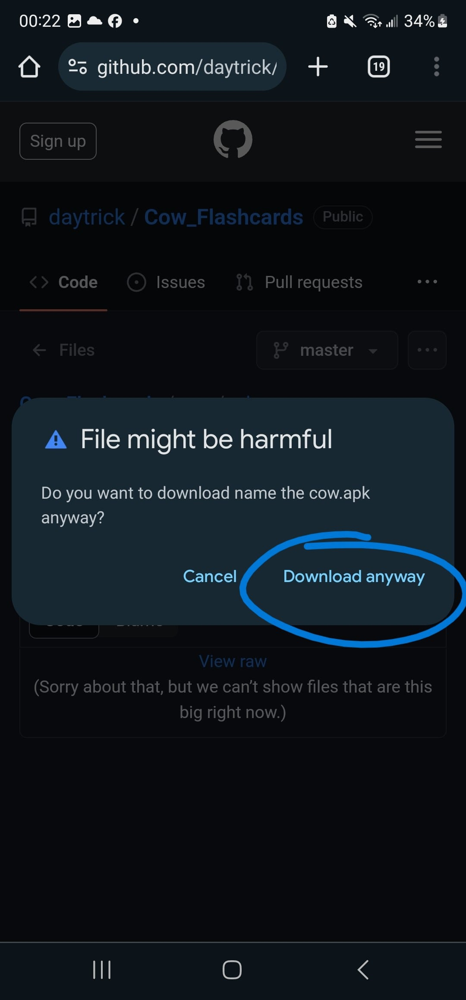
5. Once downloaded, open the APK.
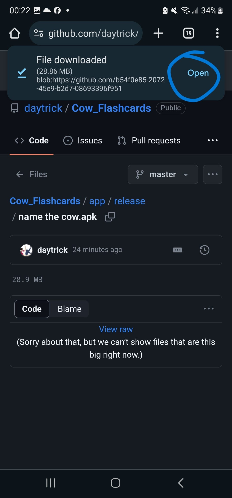
6. If prompted, open it using the package installer.
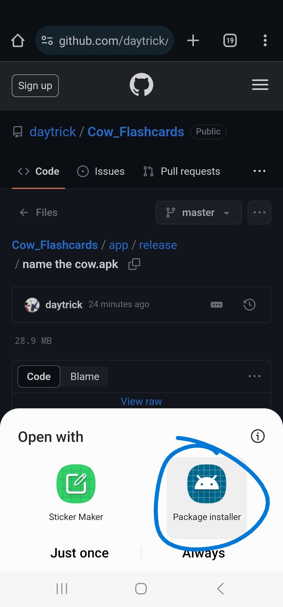
7. Your browser might ask you to grant it necessary installation permissions. Do this by opening up settings.
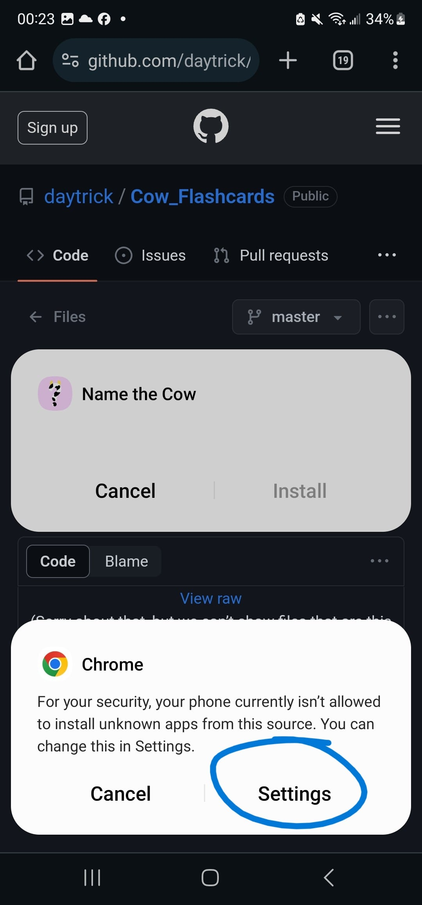
8. Find your browser and toggle the "install unknown apps" permission to on.
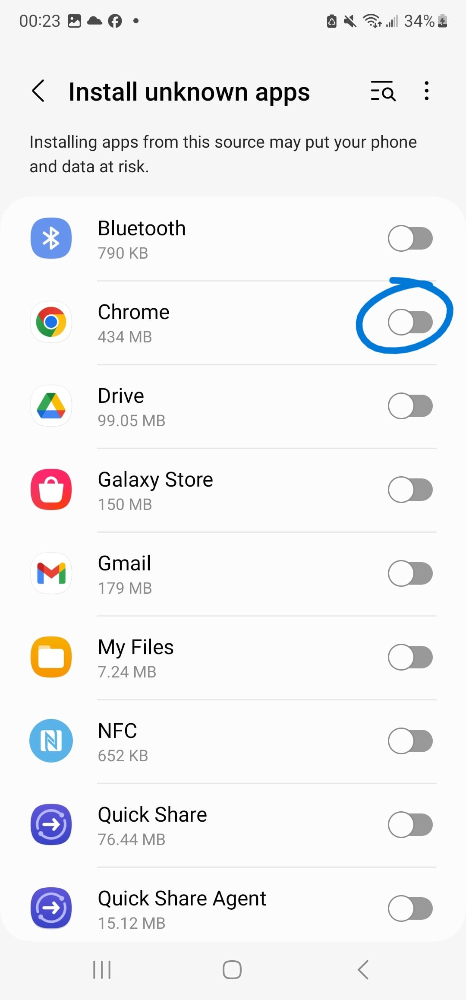
9. An installation dialogue should flash up - click install.
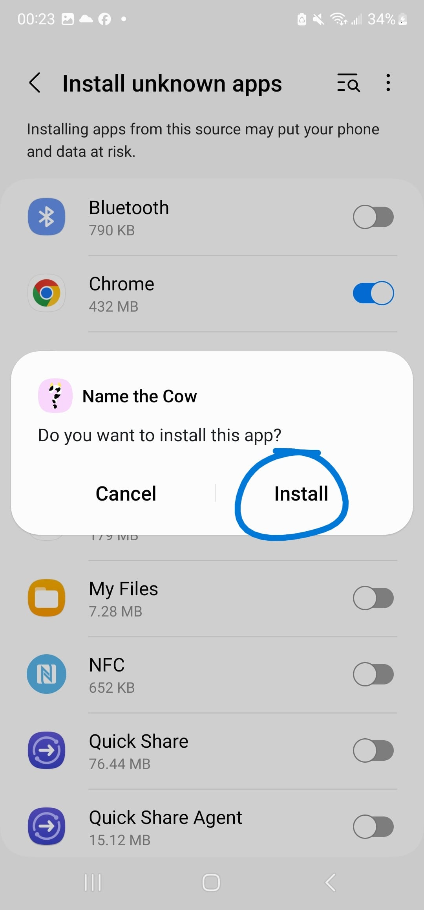
10. I'm an unknown developer, so you'll need to "install anyway". Click on the "more details" dropdown.
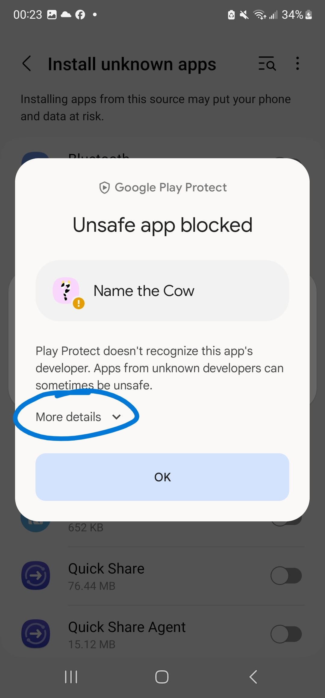
11. Click "install anyway".
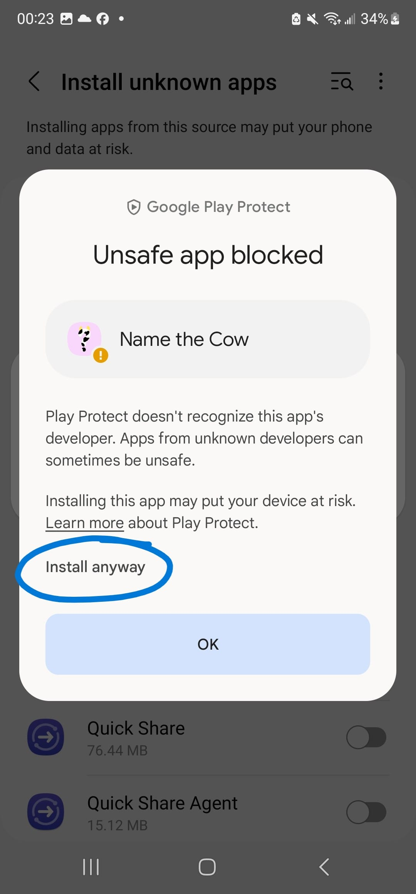
12. Congratulations! It's installed.

### Security
13. Revoke the installation permissions you just granted to your browser. Go to settings.
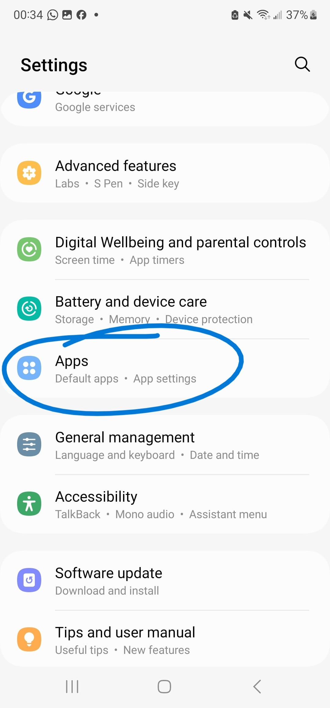
14. Scroll down to "Apps" and click on it.
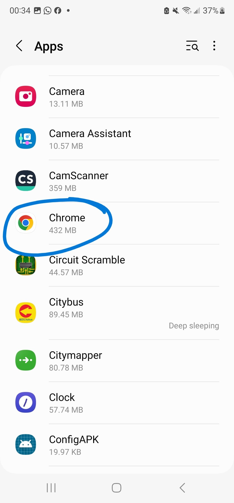
15. Find your browser and click on it.
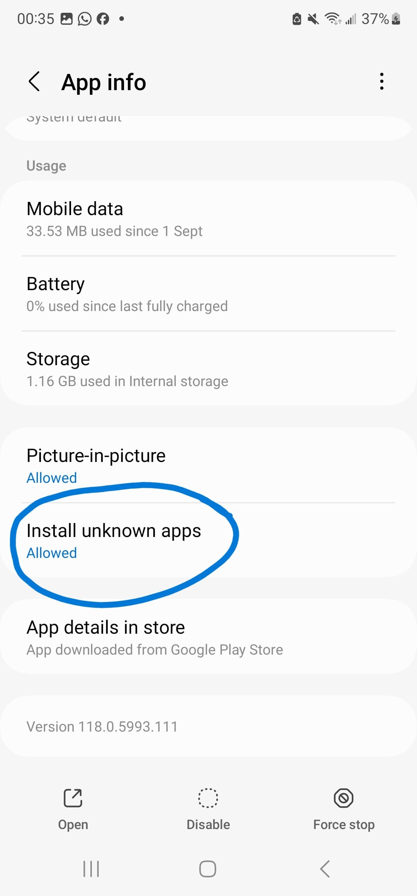
16. Scroll down and toggle "Install unknown apps" off.
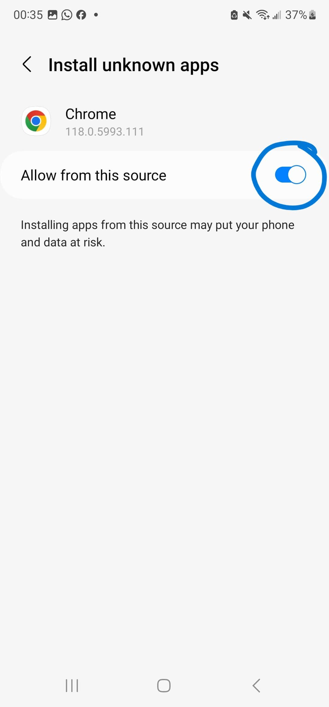
17. Your phone is safe again!

Referenced from: [Android Authority](https://www.androidauthority.com/how-to-install-apks-31494/).
